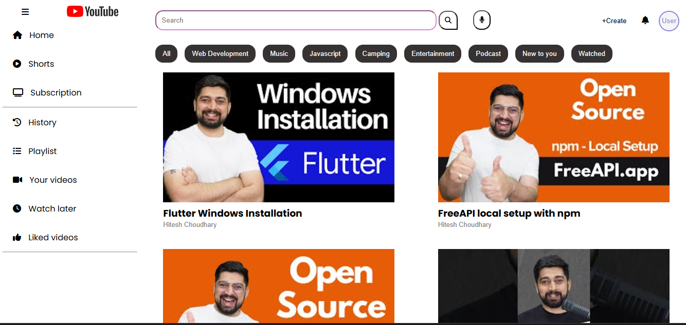
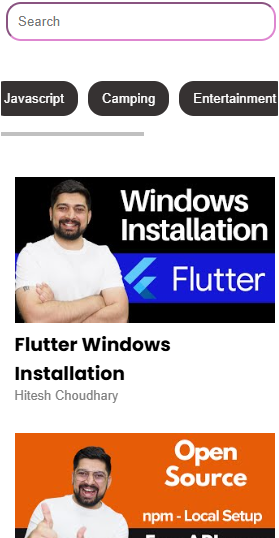

# YouTube Assignment 🎬  

## 📌 Overview  
This project is a **YouTube-like UI** built using **HTML, CSS, and JavaScript**. It includes features such as:  
- A sidebar menu with navigation items  
- YouTube UI   
- A video display section  
- A click on the video opens in YuTube 
- responsive

## How project looks:

## 📁 Folder Structure  
📂 02_Assignment(video-listing) │-- 📄 index.html
│-- 📄 style.css
│-- 📄 script.js
│-- 📂 assets (contains images)

## 🚀 Technologies Used  
- HTML  
- CSS  
- JavaScript
- FontAwesome Icons  

## Live link 
Live link:  https://shweta-nigam.github.io/video-Listing/

## api 
https://api.freeapi.app/api/v1/public/youtube/videos

## url to open in youtube
https://www.youtube.com/watch?v=${video}

## note:
I was not able to implement the filter functionality even after multiple try. As a beginner I found this feature hard. I will still try and implement it later( fine if assignment deadline couldn't be met).

